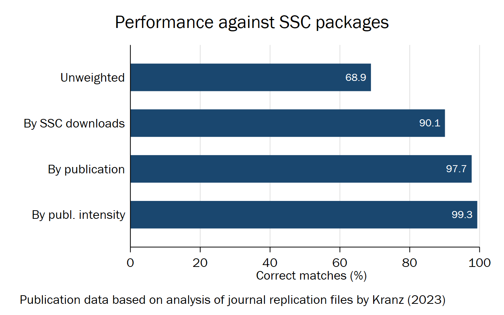

# REQUIRE: Ensure that installed Stata packages have a minimum/exact version


Ensure all required Stata packages and their specific versions are installed; similar to Python's `requirements`

-----------

## Recent Updates

- **version 1.3.0 01sep2023**:
    - Refactored code
    - Added `list` option
    - Better support for version strings in help files
    - Added tests based on certification scripts
- **version 1.0.0 27jun2023**:
    - First stable release

## Install


To install from Github, type:

```stata
cap ado uninstall require
net install require, from("https://raw.githubusercontent.com/sergiocorreia/stata-require/master/src/")
```

To install locally, type:

```stata
cap ado uninstall require
net install require, from("c:\git\stata-require\src")
```


## Usage

The most common usage is to use require to ensure that a minimum version is installed:

```stata
require ivreg2 >= 4.1.0
require ftools >= 2.48.0
require reghdfe>= 6.12.1
```

This will ensure that whoever runs the do-file is not using an outdated version of user packages.

You can also require exact versions:

```stata
require ivreg2 == 4.1.0
```

And install missing packages automatically if needed:

```stata
require ivreg2 >= 4.1.0  , install
require ftools >= 2.48.0 , install from("https://github.com/sergiocorreia/ftools/raw/master/src/")
require reghdfe>= 6.12.1 , install from(https://github.com/sergiocorreia/reghdfe/raw/master/src/)
```

Lastly, you can just use it to ensure the package is installed without specifying a version:

```stata
require ivreg2
```

### Advanced usage

Require an exact version, using Github tags (WIP):

```stata
require reghdfe == 6.12.1 , install from(https://github.com/sergiocorreia/reghdfe/releases)
```

For large projects, such as a research paper, the recommended usage is to first create a `requirements.txt` file:

```
<<< contents of requirements.txt <<<<
# SSC requirements

mdesc		>= 0.9.4	, from(ssc)
winsor2		>= 1.1		, from(ssc)
coefplot	>= 1.8.4	, from(ssc)

# Github/etc requirements

rdrobust	>= 8.1		, from(https://raw.githubusercontent.com/rdpackages/rdrobust/master/stata)
rddensity	>= 1.0		, from(https://raw.githubusercontent.com/rdpackages/rddensity/master/stata)
lpdensity	>= 1.0		, from(https://raw.githubusercontent.com/nppackages/lpdensity/master/stata)
>>>
```

And then add this line to the top of every do-file (or at the beginning of a master do-file):

```
require using "requirements.txt", install
```


## Misc. notes

We also recommend using the [`setroot`](https://github.com/sergiocorreia/stata-setroot) (based on [`here`](https://github.com/korenmiklos/here)).

(Note that `$here` currently includes trailing `/` so we can't do `use $here/dataset` and instead must do `use ${here}dataset`.


## Coverage of user packages from SSC



